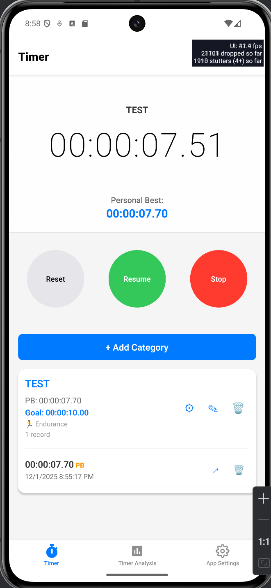
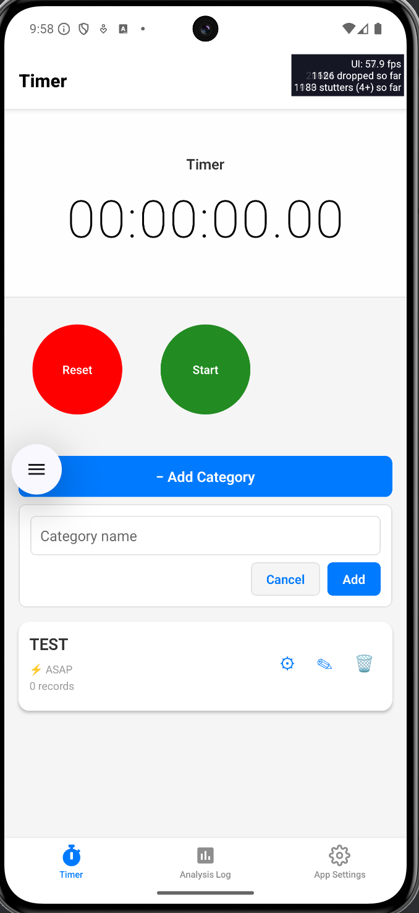
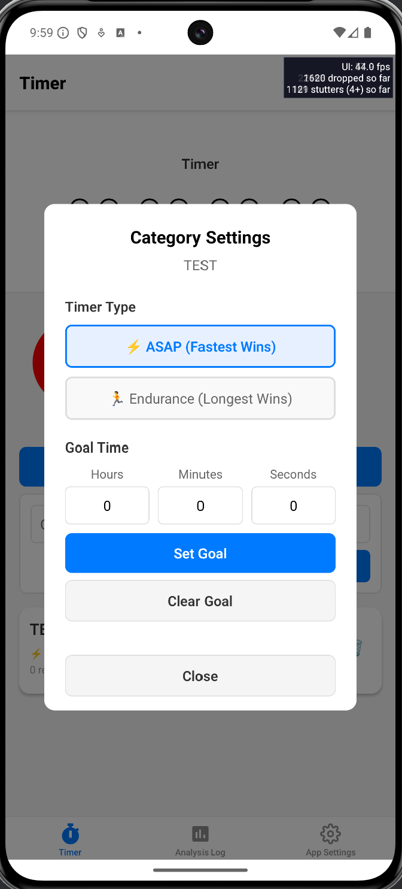
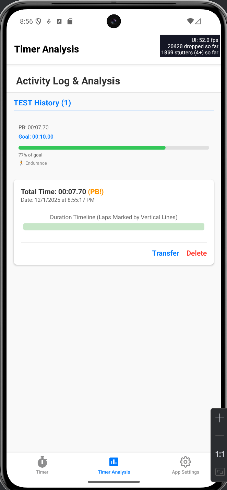
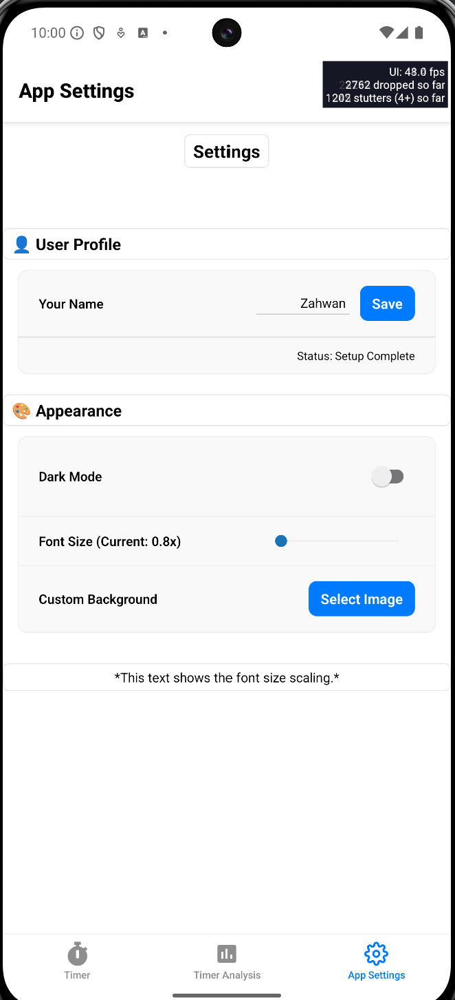
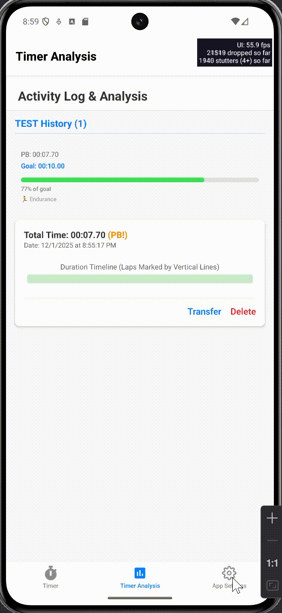

# TimerPro - Stopwatch & Personal Best Tracker


TimerPro is a cross-platform mobile application for tracking timers, personal bests, and workout records. Built with React Native and Expo, it offers flexible timer categories, goal tracking, and comprehensive analysis features. Perfect for athletes, fitness enthusiasts, and anyone who needs precise time tracking with detailed record management.

---

## 📋 Table of Contents

- [Installation & Run Instructions](#installation--run-instructions)
- [Feature List](#feature-list)
- [Screenshots](#screenshots)
- [Technologies Used](#technologies-used)
- [Known Issues & Future Improvements](#known-issues--future-improvements)

---

## 🚀 Installation & Run Instructions

### Prerequisites

- **Node.js** (LTS version recommended - v18 or higher)
- **npm** 
- **Expo Go app** (for testing on physical devices) OR
- **Android Studio** / **Xcode** (for emulator/simulator testing)

> **Note**: This project was created using `create-expo-stack`, which sets up Expo with development client support.

### Installation Steps

1. **Clone the repository** (if applicable) or navigate to the project directory:
   ```bash
   cd TimerPro
   ```

2. **Install dependencies**:
   ```bash
   npm install
   ```

3. **Start the development server**:
   ```bash
   
   npx expo start
   ```

4. **Run on a device/simulator**:
   - **iOS Simulator**: Press `i` in the terminal or run `npm run ios`
   - **Android Emulator**: Press `a` in the terminal or run `npm run android`
   - **Physical Device**: 
     - First, build and install the development client on your device
     - Then scan the QR code with the Expo Go app or use the development client
     - For development builds: `npm run build:dev` then install on device

### Building for Production

```bash
# Development build
npm run build:dev

# Preview build
npm run build:preview

# Production build
npm run build:prod
```

---

## ✨ Feature List

### 🎯 Timer Features
- **Precise Stopwatch**: High-accuracy timer with millisecond precision (updates every 10ms)
- **Start/Pause/Resume**: Full control over timer state with intuitive button controls
- **Stop & Save**: Stop timer and save records with category assignment
- **Reset Functionality**: Clear timer with confirmation dialog to prevent accidental resets
- **Lap Tracking**: Record intermediate lap times while the timer is running

### 📁 Category Management
- **Custom Categories**: Create unlimited timer categories (e.g., "100m Sprint", "5K Run", "Workout Circuit")
- **Timer Types**: 
  - **ASAP Mode**: Personal best is the fastest (shortest) time
  - **Endurance Mode**: Personal best is the longest duration
- **Goal Setting**: Set target times for each category with hours, minutes, and seconds input
- **Inline CRUD**: Add, edit, delete, and manage categories directly on the timer screen
- **Searchable Category Selection**: When saving timers, search existing categories or create new ones

### 📊 Personal Best & Records
- **Automatic PB Tracking**: System automatically tracks personal bests based on timer type
- **PB Badges**: Visual indicators show which records are personal bests
- **Record History**: View all saved timer records grouped by category
- **Record Transfer**: Move records between categories if incorrectly categorized
- **Record Deletion**: Delete individual records with confirmation

### 📈 Analysis & Progress
- **Category Statistics**: View personal best, goal, and record count for each category
- **Goal Progress**: Visual progress bars showing progress toward category goals
- **Record Visualization**: Graphical representation of lap times and total duration
- **Grouped Display**: Records organized by category with chronological sorting
- **Progress Tracking**: Percentage completion toward goals (ASAP vs Endurance logic)

### ⚙️ Settings & Customization
- **Dark Mode**: Toggle between light and dark themes
- **Font Size Scaling**: Adjustable font size multiplier (0.8x to 1.5x) for accessibility
- **Custom Background**: Set custom background images with blur effect
- **User Profile**: Set and save your name/profile information
- **Persistent Storage**: All settings, categories, and records saved locally via AsyncStorage

### 🎨 User Interface
- **Apple-Inspired Design**: Clean, modern interface inspired by iOS timer app
- **Tab Navigation**: Easy navigation between Timer, Analysis, and Settings screens
- **Modal Dialogs**: Intuitive modals for category selection, settings, and record management
- **Responsive Layout**: Adapts to different screen sizes and orientations
- **Smooth Animations**: Polished button animations and transitions

---

## 📸 Screenshots

<table>
  <tr>
    <td width="50%">
      
      <p align="center"><em>Main Timer Screen</em></p>
    </td>
    <td width="50%">
      
      <p align="center"><em>Category Management - Inline CRUD</em></p>
    </td>
  </tr>
  <tr>
    <td width="50%">
      
      <p align="center"><em>Category Management - Settings</em></p>
    </td>
    <td width="50%">
      
      <p align="center"><em>Analysis Screen</em></p>
    </td>
  </tr>
  <tr>
    <td width="50%">
      
      <p align="center"><em>Settings Screen</em></p>
    </td>
    <td width="50%">
      
      <p align="center"><em>Navigation Flow</em></p>
    </td>
  </tr>
</table>

---

## 🛠 Technologies Used

### Core Framework & Language
- **React Native** (v0.81.5) - Cross-platform mobile framework
- **React** (v19.1.0) - UI library
- **TypeScript** (v5.9.2) - Type-safe JavaScript
- **Expo** (v54.0.0) - Development platform and toolchain

### Navigation & Routing
- **Expo Router** (v6.0.10) - File-based routing system
- **React Navigation** (v7.1.6) - Navigation library

### State Management
- **Zustand** (v4.5.1) - Lightweight state management
- **AsyncStorage** (v2.2.0) - Persistent local storage

### UI & Styling
- **React Native StyleSheet** - Built-in styling solution for React Native components
- **React Native Reanimated** (v4.1.1) - Smooth animations
- **React Native Gesture Handler** (v2.28.0) - Touch gesture handling

### Expo Modules
- **expo-image-picker** (v17.0.8) - Image selection for custom backgrounds
- **expo-constants** (v18.0.9) - App constants and configuration
- **expo-device** (v8.0.9) - Device information
- **expo-status-bar** (v3.0.8) - Status bar customization

### Development Tools
- **ESLint** (v9.25.1) - Code linting
- **Prettier** (v3.2.5) - Code formatting
- **Babel** (v7.20.0) - JavaScript compiler
- **TypeScript** - Type checking

### Additional Libraries
- **@react-native-community/slider** (v5.0.1) - Slider component for font size
- **@expo/vector-icons** (v15.0.3) - Icon library

---

## 🐛 Known Issues & Future Improvements

### Known Issues
- ⚠️ **Category Settings Modal**: Layout issues resolved - all buttons now visible with proper scrolling
- ⚠️ **Pause Button**: Previously had issues with state management - now fixed with proper event handling

### Future Improvements

#### Planned Features
- [ ] **Export/Import Data**: Export records to CSV/JSON and import from backup
- [ ] **Cloud Sync**: Sync data across devices using cloud storage
- [ ] **Statistics Dashboard**: Advanced charts and graphs for performance analysis
- [ ] **Workout Templates**: Pre-defined workout routines with multiple timers
- [ ] **Social Sharing**: Share personal bests and achievements
- [ ] **Reminders & Notifications**: Set reminders for workout sessions
- [ ] **Multi-language Support**: Internationalization for multiple languages
- [ ] **Widget Support**: Home screen widgets for quick timer access

#### Technical Improvements
- [ ] **Performance Optimization**: Further optimize timer accuracy and battery usage
- [ ] **Offline-First Architecture**: Enhanced offline capabilities
- [ ] **Unit Testing**: Comprehensive test coverage
- [ ] **Accessibility**: Enhanced screen reader support and accessibility features
- [ ] **Error Handling**: Improved error boundaries and user feedback
- [ ] **Data Migration**: Tools for migrating data between app versions

#### UI/UX Enhancements
- [ ] **Custom Themes**: More theme options beyond light/dark
- [ ] **Haptic Feedback**: Tactile feedback for button presses
- [ ] **Sound Effects**: Optional audio cues for timer events
- [ ] **Gesture Controls**: Swipe gestures for quick actions
- [ ] **Apple Watch Support**: Companion app for Apple Watch

---

## 📝 Project Structure

```
TimerPro/
├── app/                    # Expo Router pages
│   ├── (tabs)/            # Tab navigation screens
│   │   ├── index.tsx      # Main timer screen
│   │   ├── analysis.tsx   # Analysis & records screen
│   │   └── settings.tsx   # Settings screen
│   └── _layout.tsx        # Root layout
├── components/            # Reusable UI components
│   ├── TimerDisplay.tsx
│   ├── TimerControls.tsx
│   ├── RecordVisualization.tsx
│   └── ...
├── store/                 # Zustand state management
│   └── useTimerStore.ts   # Main store with persistence
├── types/                 # TypeScript type definitions
│   └── index.ts
├── assets/               # Images and static assets
└── package.json          # Dependencies and scripts
```

---

## 📄 License

MIT License - See LICENSE file for details

---

## 👤 Author

Sulaiman Zahwan Latheef - S2301159 - UWE ID: 23081518

---

## 🙏 Acknowledgments

- Created with [create-expo-stack](https://github.com/danstepanov/create-expo-stack) - Expo project scaffolding tool
- link to my Github Repo: https://github.com/Zahwan69/TimerPro-MobileApp
- Inspired by Apple's Timer app design
- Built with Expo and React Native community tools
